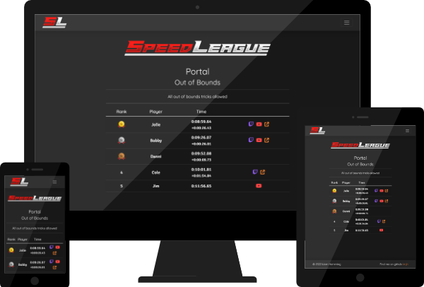

# SpeedLeague

SpeedLeague is a Flask leaderboard application to rank the scores of people competing at [speedrunning](https://en.wikipedia.org/wiki/Speedrun). SpeedLeague uses a MongoDB NoSQL database, accessed via the Flask-PyMongo extension. SpeedLeague was developed as a favour for a friend and as a practice project to improve and expand my skills with the Flask framework.



The live site is deployed using Heroku and can be viewed [here](https://speedleague.herokuapp.com/).

To view the admin panel features, [login here](https://speedleague.herokuapp.com/login) with the following credentials:

```
Username: demouser
Password: demopass
```

Note that this is a restricted account which cannot add, edit or delete data.

## Features

### Leaderboards
- Leaderboards are generated for different games and categories.
- Player scores are automatically ranked and only a player's fastest time per category is shown.
- The leaderboard calculates and displays the gap between positions (i.e. how much faster a score is than the score below it).
- Up to three external links can be added to each player profile.

### Content Management System
- A full-featured admin interface allows logged in users to manage site content.
- Logged in users can add, update and delete players and player scores.
- Logged in users can also add, update and delete games and categories.
- Logged in users can update their own passwords.
- The nav menu links are automatically updated when games and categories are created, updated or deleted.
- An admin account with special priviledges is included.
- Only the admin account has the ability to add or remove user accounts. There is no open registration system, as editing the database is intended to be restricted to approved users.

## Technologies

### Languages

- Python
- HTML
- CSS

### Frameworks and Libraries

- [Flask](https://palletsprojects.com/p/flask/), [Jinja](https://jinja.palletsprojects.com/en/3.0.x/) and [Werkzeug](https://palletsprojects.com/p/werkzeug/) - Used to build the main application structure, page templates (Jinja) and account security (Werkzeug).
- [MongoDB](https://www.mongodb.com/) - Used for the application's database.
- [PyMongo](https://github.com/mongodb/mongo-python-driver) - Used to connect Python with MongoDB.
- [Heroku](https://heroku.com/) - Used to deploy the site.
- [Bootstrap 5](https://getbootstrap.com/) - Used to create layout and styling of site.
- [Bootswatch Darkly](https://bootswatch.com/darkly/) - Used as basis for dark-mode design, with custom styles applied on top.
- [Affinity Designer](https://affinity.serif.com/en-gb/designer/) - Used to design logo and illustrations.
- [Google Fonts](https://fonts.google.com/) - Used for site fonts ([Quicksand](https://fonts.google.com/specimen/Quicksand) and [Signika Negative](https://fonts.google.com/specimen/Signika+Negative))
- [Iconian Fonts](https://www.iconian.com/) - Source of 'Paladins' font used in logo.